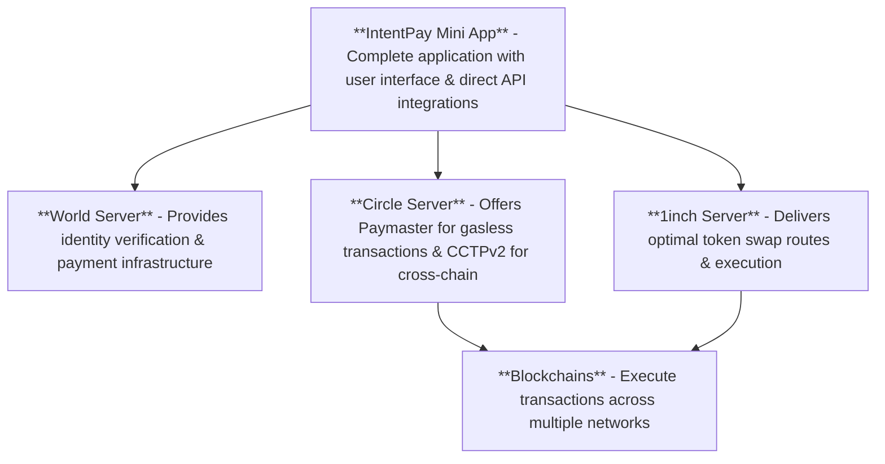

# IntentPay

[](https://github.com/IntentPay/intent-pay/tree/develop-world/assets/IntentPay_banner.png)
**IntentPay** is a gasless wallet Mini App built on the **World App** platform that enables seamless USDC-priced, cross-chain transactions and intent-based trading. Powered by Circle's Modular wallet technology and 1inch's API, users can execute transactions through World App payments without worrying about gas fees while being verified as unique humans through World ID.

## Vision

**IntentPay** empowers World App's user base with a modern, gasless crypto wallet experience. By combining:

- **Circle's Modular Wallet** for secure, non-custodial wallet infrastructure
- **1inch API** for optimal trading and liquidity aggregation
- **World ID verification and World App payments** for Sybil-resistance, human verification, and seamless payments

We create a frictionless financial experience that removes the complexity of gas fees and wallet management while ensuring security and efficiency for all users.

## Core Features

- **💱 USDC-Priced Cross-Chain Swaps**:
  All transactions priced in USDC regardless of destination chain or token
- **💳 World App Payment Integration**:
  Pay for swaps directly through World App without connecting personal wallets
- **📱 QR Code Address Scanning**:
  Easily input recipient addresses by scanning QR codes
- **⛽ Gasless Transactions**:
  Execute transfers without managing gas fees using IntentPay's official Circle wallet
- **🎯 Intent-Based Trading**:
  Submit trade intentions that get executed optimally via 1inch
- **👋 Human Verification**:
  Privacy-preserving verification using World ID and zero-knowledge proofs
- **🤖 Immersive Haptic Feedback**:
  Enhance user interactions with responsive tactile feedback, making the experience more engaging and satisfying. This feature is designed to improve accessibility for visually impaired users and enrich the overall user experience.
- **𖢻 Multi-chain Support**:
  Transact across multiple blockchains seamlessly
- **🔒 Enhanced Security**:
  Passkey authentication and risk-based transaction screening
- **📊 Portfolio Tracking**:
  View balances and transaction history across supported chains

## Technical Architecture

- **Frontend**: NextJS 15 App Router with React 19
- **Styling**: TailwindCSS with shadcn/ui components
- **Wallet Infrastructure**: Circle Modular wallet technology
- **Trading System**: 1inch API for optimized intent execution
- **Identity & Payments**: World ID via MiniKit SDK and World App payment processing
- **QR Scanning**: Camera integration for address input
- **State Management**: React Context and custom hooks

## Project Structure

```
intent-pay/
├── app/                         # NextJS App Router
│   ├── (dashboard)/             # Dashboard layout and pages
│   │   ├── wallet/              # Wallet-related pages
│   │   ├── trade/               # Trading pages
│   │   └── profile/             # User profile pages
│   ├── api/                     # NextJS API routes
│   │   ├── circle/              # Circle API endpoints
│   │   ├── oneinch/             # 1inch API endpoints
│   │   └── worldid/             # World ID verification endpoints
│   ├── login/                   # Authentication pages
│   └── services/                # Backend services
├── components/                  # Reusable UI components
│   ├── ui/                      # Base UI components (shadcn/ui)
│   ├── wallet/                  # Wallet-specific components
│   ├── swap/                    # Swap form components
│   ├── scanner/                 # QR code scanner components
│   └── trading/                 # Trading-specific components
├── lib/                         # Utility functions and services
│   ├── circle/                  # Circle wallet integration
│   ├── oneinch/                 # 1inch API integration
│   ├── worldid/                 # World ID integration
│   ├── payment/                 # World App payment integration
│   └── utils/                   # Shared utilities
├── public/                      # Static assets
└── config files                 # Configuration files
```

## System Architecture Overview



## Installation and Setup

### Prerequisites

- **Node.js** (v18 or higher)
- **pnpm** (preferred) or npm
- **World App** installed for testing

### Installation Steps

1. **Clone the repository**:

   ```bash
   git clone https://github.com/your-organization/intentpay.git
   ```

2. **Install dependencies**:

   ```bash
   pnpm install
   ```

3. **Set up environment variables**:

   - Copy `.env.example` to `.env.local`
   - Add necessary API keys for Circle, 1inch, and World Mini App

4. **Run the development server**:

   ```bash
   pnpm dev
   ```

5. **Access the application**:
   - Development: Visit `http://localhost:3000` in your browser
   - Mini App: Test within World App development environment

## API Integrations

### Circle Modular Wallet

- **Smart Contract Wallets**: Non-custodial programmable wallet infrastructure
- **Transaction Sponsorship**: Enable gasless transactions for users
- **Passkey Authentication**: Secure access without seed phrases
- **Multi-chain Support**: Seamless cross-chain experience

### 1inch API

- **Intent-Based Trading**: Submit trade intents instead of direct swaps
- **Aggregation Protocol**: Access to deep liquidity across DEXes
- **Gas Optimization**: Efficient execution path finding
- **MEV Protection**: Shield transactions from front-running

### World ID and World App Payments

- **Sybil Resistance**: Verify unique humans via World ID
- **MiniKit Integration**: Streamlined integration with World App
- **Privacy-Preserving**: Zero-knowledge proof verification
- **Integrated Payments**: Process payments directly through World App

## Team Collaboration Guidelines

### Development Workflow

1. **Feature Planning**:

   - Create detailed issues in GitHub with acceptance criteria
   - Break down features into manageable tasks

2. **Branching Strategy**:

   - `main`: Production-ready code
   - `develop`: Integration branch for features
   - `feature/feature-name`: Individual feature branches
   - `fix/bug-name`: Bug fix branches

3. **Code Standards**:

   - Follow the project's TypeScript and ESLint standards
   - Use Prettier for consistent formatting
   - Write meaningful commit messages following Conventional Commits

4. **Pull Requests**:

   - Create descriptive PRs with clear explanations
   - Link PRs to related issues
   - Require at least one review before merging
   - Use PR templates for consistency

5. **Documentation**:
   - Document all components and functions with JSDoc
   - Update README when adding significant features
   - Document API integration details

### Communication

- Use GitHub Discussions for technical decisions
- Document architectural decisions in ADRs (Architecture Decision Records)
- Regular standup meetings to sync on progress and blockers

## Development Roadmap

1. **Phase 1: Core Wallet Infrastructure**

   - Circle Modular Wallet integration
   - Basic USDC transfers
   - World ID verification

2. **Phase 2: Trading Functionality**

   - 1inch API integration
   - Intent-based trading interface
   - Portfolio tracking

3. **Phase 3: Enhanced Features**

   - World App payment integration
   - QR code scanning for addresses
   - Multi-chain support expansion
   - Advanced security features
   - Performance optimizations

## License

This project is licensed under the MIT License - see the LICENSE file for details.
