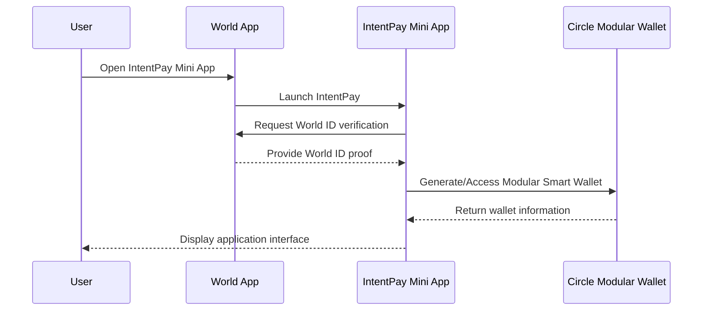
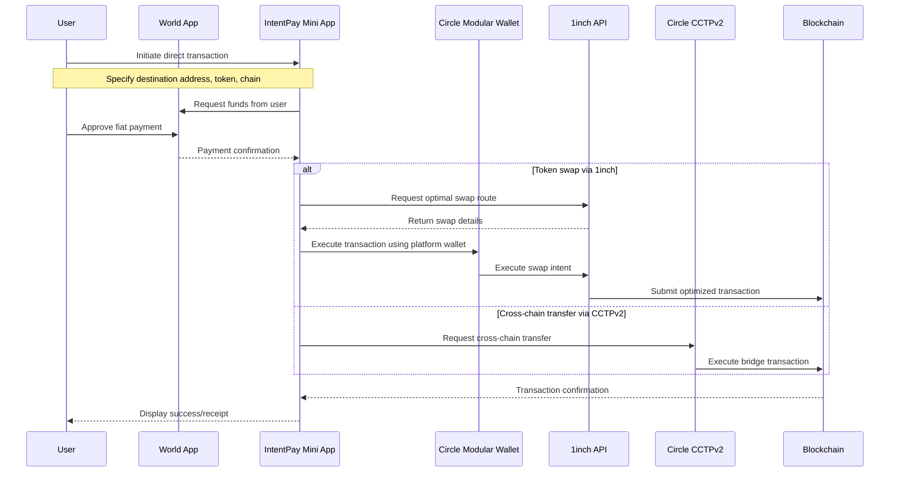
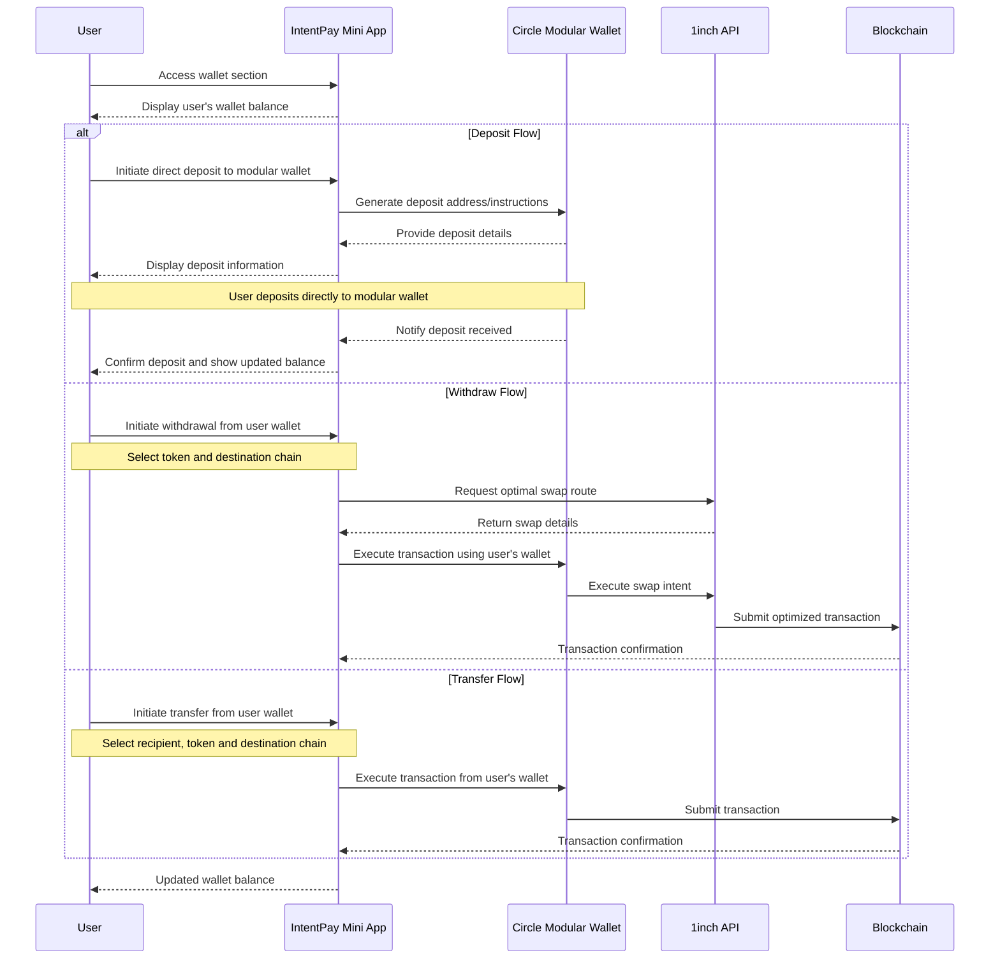
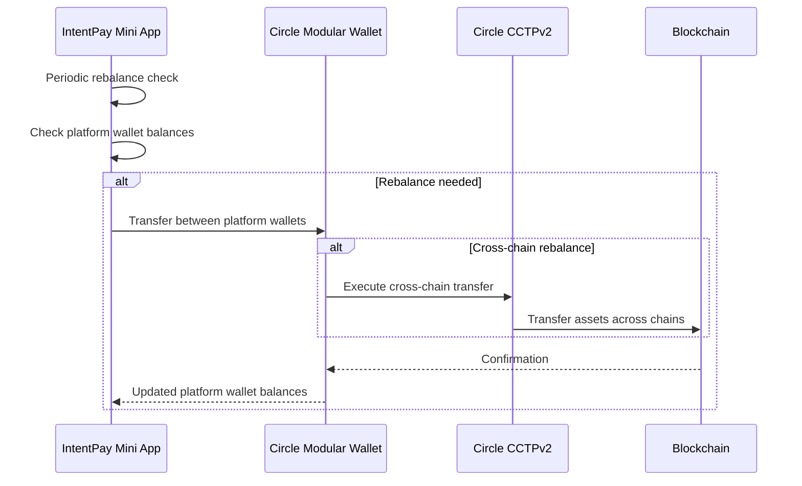

# Sequential Chart of Main behaviors

## Login / Sign up 

```mermaid
sequenceDiagram
    participant User
    participant World_App as World App
    participant IntentPay_App as IntentPay Mini App
    participant Circle_Wallet as Circle Modular Wallet

    %% Signup/Login Flow
    User->>World_App: Open IntentPay Mini App
    World_App->>IntentPay_App: Launch IntentPay
    IntentPay_App->>World_App: Request World ID verification
    World_App-->>IntentPay_App: Provide World ID proof
    IntentPay_App->>Circle_Wallet: Generate/Access Modular Smart Wallet
    Circle_Wallet-->>IntentPay_App: Return wallet information
    IntentPay_App-->>User: Display application interface
```

## Intent Pay

```mermaid
sequenceDiagram
    participant User
    participant World_App as World App
    participant IntentPay_App as IntentPay Mini App
    participant Circle_Wallet as Circle Modular Wallet
    participant OneInch as 1inch API
    participant CCTP as Circle CCTPv2
    participant Blockchain

    %% IntentPay Flow - Direct Payment Without User Wallet
    User->>IntentPay_App: Initiate direct transaction
    Note over User,IntentPay_App: Specify destination address, token, chain
    IntentPay_App->>World_App: Request funds from user
    User->>World_App: Approve fiat payment
    World_App-->>IntentPay_App: Payment confirmation
    
    alt Token swap via 1inch
        IntentPay_App->>OneInch: Request optimal swap route
        OneInch-->>IntentPay_App: Return swap details
        IntentPay_App->>Circle_Wallet: Execute transaction using platform wallet
        Circle_Wallet->>OneInch: Execute swap intent
        OneInch->>Blockchain: Submit optimized transaction
    else Cross-chain transfer via CCTPv2
        IntentPay_App->>CCTP: Request cross-chain transfer
        CCTP->>Blockchain: Execute bridge transaction
    end
    
    Blockchain-->>IntentPay_App: Transaction confirmation
    IntentPay_App-->>User: Display success/receipt
```

## Intent Wallet (Deposit / Withdraw / Transfre)

```mermaid 
sequenceDiagram
    participant User
    participant IntentPay_App as IntentPay Mini App
    participant Circle_Wallet as Circle Modular Wallet
    participant OneInch as 1inch API
    participant Blockchain

    %% IntentWallet Flow - User Wallet Operations
    User->>IntentPay_App: Access wallet section
    IntentPay_App-->>User: Display user's wallet balance
    
    alt Deposit Flow
        User->>IntentPay_App: Initiate direct deposit to modular wallet
        IntentPay_App->>Circle_Wallet: Generate deposit address/instructions
        Circle_Wallet-->>IntentPay_App: Provide deposit details
        IntentPay_App-->>User: Display deposit information
        Note over User,Circle_Wallet: User deposits directly to modular wallet
        Circle_Wallet-->>IntentPay_App: Notify deposit received
        IntentPay_App-->>User: Confirm deposit and show updated balance
    else Withdraw Flow
        User->>IntentPay_App: Initiate withdrawal from user wallet
        Note over User,IntentPay_App: Select token and destination chain
        IntentPay_App->>OneInch: Request optimal swap route
        OneInch-->>IntentPay_App: Return swap details
        IntentPay_App->>Circle_Wallet: Execute transaction using user's wallet
        Circle_Wallet->>OneInch: Execute swap intent
        OneInch->>Blockchain: Submit optimized transaction
        Blockchain-->>IntentPay_App: Transaction confirmation
    else Transfer Flow
        User->>IntentPay_App: Initiate transfer from user wallet
        Note over User,IntentPay_App: Select recipient, token and destination chain
        IntentPay_App->>Circle_Wallet: Execute transaction from user's wallet
        Circle_Wallet->>Blockchain: Submit transaction
        Blockchain-->>IntentPay_App: Transaction confirmation
    end
    
    IntentPay_App-->>User: Updated wallet balance
```

## Internal Rebalancing 

```mermaid
sequenceDiagram
    participant IntentPay_App as IntentPay Mini App
    participant Circle_Wallet as Circle Modular Wallet
    participant CCTP as Circle CCTPv2
    participant Blockchain

    %% Rebalance Flow - Background Process
    IntentPay_App->>IntentPay_App: Periodic rebalance check
    IntentPay_App->>IntentPay_App: Check platform wallet balances
    
    alt Rebalance needed
        IntentPay_App->>Circle_Wallet: Transfer between platform wallets
        alt Cross-chain rebalance
            Circle_Wallet->>CCTP: Execute cross-chain transfer
            CCTP->>Blockchain: Transfer assets across chains
        end
        Blockchain-->>Circle_Wallet: Confirmation
        Circle_Wallet-->>IntentPay_App: Updated platform wallet balances
    end
```
