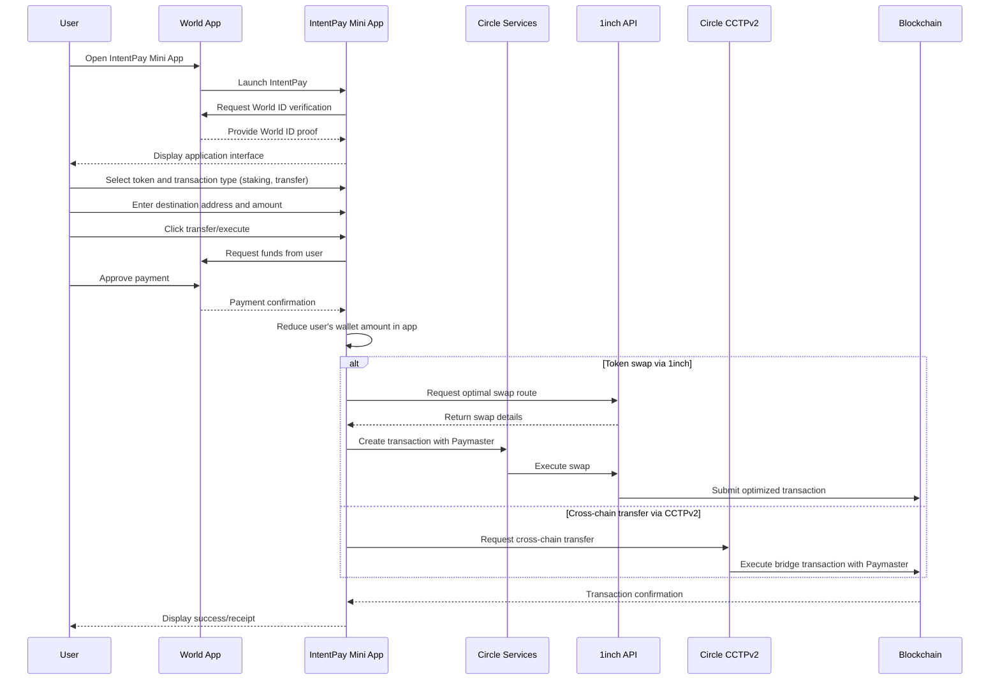

# Sequential Chart of Main behaviors

```mermaid
sequenceDiagram
    participant User
    participant World_App as World App
    participant IntentPay_App as IntentPay Mini App
    participant Circle_Services as Circle Services
    participant OneInch as 1inch API
    participant CCTP as Circle CCTPv2
    participant Blockchain

    %% Signup/Login Flow
    User->>World_App: Open IntentPay Mini App
    World_App->>IntentPay_App: Launch IntentPay
    IntentPay_App->>World_App: Request World ID verification
    World_App-->>IntentPay_App: Provide World ID proof
    IntentPay_App-->>User: Display application interface

    %% IntentPay Direct Payment Flow
    User->>IntentPay_App: Select token and transaction type (staking, transfer)
    User->>IntentPay_App: Enter destination address and amount
    User->>IntentPay_App: Click transfer/execute
    IntentPay_App->>World_App: Request funds from user
    User->>World_App: Approve payment
    World_App-->>IntentPay_App: Payment confirmation
    IntentPay_App->>IntentPay_App: Reduce user's wallet amount in app
    
    alt Token swap via 1inch
        IntentPay_App->>OneInch: Request optimal swap route
        OneInch-->>IntentPay_App: Return swap details
        IntentPay_App->>Circle_Services: Create transaction with Paymaster
        Circle_Services->>OneInch: Execute swap
        OneInch->>Blockchain: Submit optimized transaction
    else Cross-chain transfer via CCTPv2
        IntentPay_App->>CCTP: Request cross-chain transfer
        CCTP->>Blockchain: Execute bridge transaction with Paymaster
    end
    
    Blockchain-->>IntentPay_App: Transaction confirmation
    IntentPay_App-->>User: Display success/receipt
```